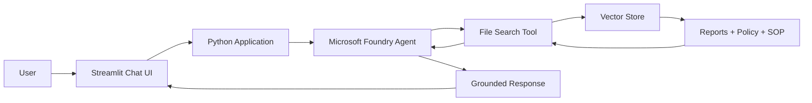

# Azure AI Agent RAG — Operations Intelligence Assistant

A production-style **Retrieval-Augmented Generation (RAG)** portfolio project built with **Microsoft Foundry (Azure AI), Python, Foundry Agent Service, and File Search**.

The agent answers operational questions from a synthetic monthly report, policy, and SOP. It is designed to demonstrate a critical enterprise AI behavior: **retrieve evidence first, reason over it, and refuse to invent facts when the source documents do not support a conclusion.**

> **Portfolio note:** All organization names, reports, policies, and operational values in this repository are fictional and created solely for demonstration. No employer or confidential data is used.

## Why this project exists

Operations teams often store important information across monthly reports, policies, SOPs, and technical documents. Analysts must search multiple sources before they can answer questions such as:

- Does a KPI change cross a formal investigation threshold?
- What action does a policy require?
- What does the report actually confirm versus merely suggest?
- Which checks should an analyst perform before assigning a root cause?

A general-purpose LLM can answer confidently without evidence. This project uses RAG to ground the agent in a controlled knowledge base and instructs it to identify unknowns rather than hallucinate a diagnosis.

## Business problem

In the fictional **Northstar Water Operations** scenario, the July report shows:

- treated flow: **+18%**,
- energy consumption: **+12%**,
- chemical cost: **+4%**,
- rainfall: **-35%**.

A separate policy states that a **formal equipment-efficiency investigation is required only when energy consumption increases by more than 20%**.

The useful AI behavior is therefore not simply extracting `12%` from one document. The agent must retrieve the monthly report **and** the policy, compare the values, and conclude that the July increase does **not** automatically require a formal investigation. If asked what caused the increase, it should state that the cause is not confirmed because the source report does not establish one.

## Architecture



### Retrieval flow

1. Markdown knowledge documents are uploaded to a Foundry vector store.
2. Foundry processes the documents for file search.
3. A versioned prompt agent is created with the file-search tool attached.
4. The user sends a question through the Streamlit interface.
5. The agent retrieves relevant document content before generating its answer.
6. The response follows grounding rules that separate confirmed evidence from unsupported assumptions.
7. An evaluation script checks representative questions for required facts and prohibited hallucinated claims.

## Technologies

| Technology | Purpose |
|---|---|
| Microsoft Foundry / Azure AI | AI project, agent, model, and tool orchestration |
| Foundry Agent Service | Versioned agent instructions and execution |
| Azure AI Projects SDK | Python access to Foundry project APIs |
| File Search | Retrieval over uploaded business documents |
| Vector Store | Indexed knowledge used for semantic/keyword retrieval |
| Python | Application, ingestion, evaluation, and cleanup logic |
| Streamlit | Interactive recruiter/demo UI |
| Microsoft Entra ID | Credential-based authentication through `DefaultAzureCredential` |
| Pytest | Lightweight unit testing |
| GitHub Actions | Automated unit-test CI on pushes and pull requests |

## Repository structure

```text
azure-ai-agent-rag/
├── app.py
├── README.md
├── LICENSE
├── requirements.txt
├── .env.example
├── .gitignore
├── .github/
│   └── workflows/
│       └── tests.yml
├── src/
│   ├── config.py
│   └── foundry_rag.py
├── scripts/
│   ├── ingest.py
│   ├── evaluate.py
│   └── cleanup.py
├── data/
│   └── knowledge_base/
│       ├── monthly_operations_report_july_2026.md
│       ├── energy_efficiency_policy.md
│       └── efficiency_investigation_sop.md
├── eval/
│   ├── test_cases.json
│   └── results.example.json
├── assets/
│   └── screenshots/
│       └── README.md
└── tests/
    └── test_eval_logic.py
```

## Key engineering decisions

### 1. Grounding before generation

The agent is explicitly instructed to use the document knowledge base for factual operational questions and to avoid inventing numbers, thresholds, incidents, or root causes.

### 2. Cross-document reasoning

The main demo requires information from multiple sources. The monthly report contains the observed **12%** increase, while the policy contains the **greater-than-20%** investigation threshold.

### 3. Hallucination control

The monthly report intentionally says that the cause of the energy increase is not confirmed. One evaluation case asks the agent directly for the cause. A good answer must resist inventing an equipment failure.

### 4. Repeatable lifecycle

The repository separates:

- ingestion and resource creation,
- application interaction,
- evaluation,
- Azure resource cleanup.

The generated Foundry resource identifiers are stored locally in `.rag_resources.json`, which is excluded from Git.

### 5. Automated validation

GitHub Actions runs unit tests automatically on pushes and pull requests to `main`, providing a basic CI quality gate for the application logic.

## Sample input and expected behavior

### Example 1 — Cross-document policy reasoning

**User**

> Does the July 2026 energy increase require a formal equipment-efficiency investigation?

**Expected behavior**

The agent should explain that July energy consumption increased by **12%**, while policy requires a formal investigation only for increases **greater than 20%**. Therefore, a formal investigation is **not mandatory solely because of the July percentage increase**.

### Example 2 — Hallucination resistance

**User**

> What caused the July 2026 energy consumption increase?

**Expected behavior**

The agent should state that the documents do **not confirm a cause**. It may recommend reviewing meter data, runtime, maintenance history, and operating conditions, but it should not claim that a pump or other equipment failed.

### Example 3 — Policy application

**User**

> If energy consumption increases by 24% next month, what action is required?

**Expected behavior**

The agent should retrieve the policy and state that an increase greater than 20% and up to 30% requires a **formal equipment-efficiency investigation within five business days**.

## Evaluation strategy

The project includes a deterministic evaluation harness in `scripts/evaluate.py`.

Each test case defines:

- a business question,
- terms that should appear in a grounded answer,
- claims that must not appear.

Current test scenarios cover:

1. policy-threshold reasoning,
2. hallucination resistance,
3. future policy application,
4. KPI retrieval,
5. SOP retrieval.

Run the evaluation against your deployed agent:

```bash
python scripts/evaluate.py
```

The script creates `eval/results.json` with pass/fail results, response latency, overall pass rate, and generated answers for review.

## Evaluation Results

| Evaluation Scenario | Result |
|---|---|
| Policy threshold reasoning | ✅ PASS |
| Hallucination control | ✅ PASS |
| Future threshold interpretation | ✅ PASS |
| Operational metric retrieval | ✅ PASS |
| SOP retrieval | ✅ PASS |

**Pass Rate:** 100%  
**Average Response Latency:** 5.10 seconds  
**Unit Tests:** 2/2 passed

The evaluation demonstrates the agent's ability to retrieve relevant business documents, reason across multiple sources, apply policy thresholds, and avoid unsupported root-cause claims.

## Setup

### Prerequisites

You need:

- an Azure subscription,
- a Microsoft Foundry project,
- a deployed model in that project,
- Python,
- Azure CLI,
- permission to create and run Foundry agents and upload files.

### 1. Clone the repository

```bash
git clone https://github.com/NiknazNgh/azure-ai-agent-rag.git
cd azure-ai-agent-rag
```

### 2. Create a virtual environment

Windows PowerShell:

```powershell
python -m venv .venv
.\.venv\Scripts\Activate.ps1
```

macOS/Linux:

```bash
python -m venv .venv
source .venv/bin/activate
```

### 3. Install dependencies

```bash
pip install -r requirements.txt
```

### 4. Authenticate to Azure

```bash
az login
```

### 5. Configure environment variables

Copy `.env.example` to `.env` and configure your Foundry project endpoint and model deployment name. Do not commit `.env`.

### 6. Ingest the knowledge base and create the agent

```bash
python scripts/ingest.py
```

### 7. Run the application

```bash
streamlit run app.py
```

### 8. Run evaluation

```bash
python scripts/evaluate.py
```

### 9. Run unit tests

```bash
pytest -q
```

### 10. Clean up cloud resources

```bash
python scripts/cleanup.py
```

## CI

The repository includes a GitHub Actions workflow that runs the unit test suite on pushes and pull requests to `main`.

```text
Push / Pull Request
        ↓
GitHub Actions
        ↓
Python 3.12
        ↓
Install dependencies
        ↓
pytest
```

## What I learned

- **RAG quality depends on evidence design, not only the model.**
- **Retrieval and reasoning are separate concerns.**
- **A confident answer is not necessarily a grounded answer.**
- **Enterprise agents need lifecycle management.**
- **Authentication and configuration should be separated from source code.**
- **Evaluation and automated tests make an AI demo more credible and repeatable.**

## Production Engineering Roadmap

The next iteration will extend the project toward a more complete deployment architecture:

- FastAPI REST API
- structured JSON responses
- AI tool/function calling
- retry and resilience patterns
- Docker containerization
- Azure Container Apps deployment
- Microsoft Entra ID / managed identity access control
- Application Insights and agent tracing
- deployment-focused GitHub Actions workflow

These items are explicitly a **roadmap** and are not represented as completed production capabilities yet.

## Skills demonstrated

`Microsoft Foundry` `Azure AI` `Generative AI` `AI Agents` `RAG` `Python` `File Search` `Vector Search` `Prompt Engineering` `Evaluation` `Streamlit` `Microsoft Entra ID` `Pytest` `GitHub Actions` `GitHub`

## Author

**Niknaz Negahdarhaghighat (Niki)**  
AI, Data & Automation Professional

- LinkedIn: https://www.linkedin.com/in/niknazngh/
- GitHub: https://github.com/NiknazNgh

## License

This project is licensed under the MIT License.
